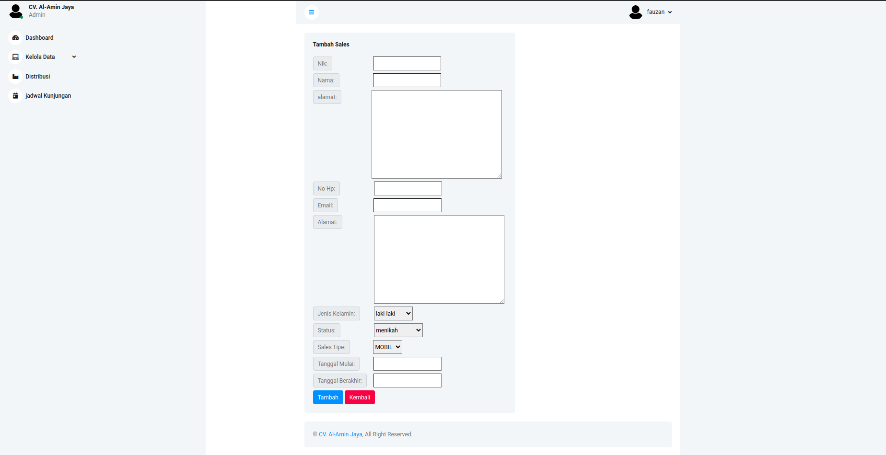

# <h1 align="center">**Sari Roti**</h1>

<center>

<p><b> This system is designed to make it easier for Sari Roti distributors to forecast the number of deliveries in shops </b></p>

</center>
<br/>

<br/>
<hr/>

<!-- <span style='font-size:20px;'>&#128204;</span> -->

## **Contents**

<br/>

- [**Instalation**](#instalation)

- [**What To Do**](#what-to-do)

- [**Feature Desc**](#feature-desc)

- [**Preview**](#preview)

- [**Download**](#Download)

<br/>
<hr/>

## **Instalation**

<br/>

1. Clone this repository

   ```bash
   $ git clone https://github.com/Xoxxox21/forecasting-the-amount-of-bread-using-the-holt-winter-method.git
   ```

2. Open Project Folder

   ```
   $ cd forecasting-the-amount-of-bread-using-the-holt-winter-method
   ```

3. Instal Depedencies

   ```
   $ pip install -r requirment.txt
   ```

4. Run the Project
   ```
   $ python3 manage.py runserver
   ```

<br/>
<hr/>

## **What To Do ?**

<br/>

1. admin registers sales and an account will be created for sales.
2. admin makes sales schedule to deliver bread in the store.
3. sales login by entering NIK and initial NIK password.
4. select a store and forecast results will come out for that store on that day if there is a sales/user schedule.

<br/>
<hr/>

## **Feature Desc**

### <span style='font-size:15px;'>&#10032;</span> admin after logging in, the system allows admin to:

- manage store data, sales, bakery, sales schedule
- view distribution results report

### <span style='font-size:15px;'>&#10032;</span> sales after logging in, the system allows sales to:

- choose a shop to deliver the bread
- view forecast results for the selected store

### <span style='font-size:15px;'>&#10032;</span> Edit Profile, the system allows admin and sales to:

- Change Password

<br/>
<hr/>

## **Preview**

<p align="center">
<br />
<br />
<br />
<br />
<br />
<br />
<br />
<br />
</p>

